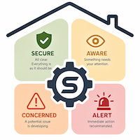

# **Checkpoints**

A **Checkpoint** is an Indigo device that the homeowner creates to represent a condition they care about.

Each checkpoint monitors one or more binary signals, interprets their significance, and continuously evaluates how much concern that condition should currently represent.

In other words, a checkpoint transforms simple device states into meaningful awareness.

---

# **Purpose**

Devices report facts.

Checkpoints determine what those facts mean.

A contact sensor simply reports whether a door is open or closed.

A lock reports whether it is locked or unlocked.

A motion sensor reports whether motion is occurring.

A leak detector reports whether water has been detected.

Those devices report facts accurately, but facts alone do not determine whether the homeowner should care.

An open garage door while unloading groceries is very different from an open garage door that has remained open for two hours after everyone has gone to bed.

A checkpoint exists to understand that difference.

---

# **Homeowner Defined**

Every checkpoint is created and configured by the homeowner.

When creating a checkpoint, the homeowner defines:

- the device or devices that should be monitored
- the type of condition being interpreted
- how important that condition is
- whether its significance should increase or decrease over time

Every checkpoint represents something that is personally meaningful to the homeowner.

Some examples might include:

- Front Door
- Garage Door
- Basement Window
- Wine Cellar
- Water Heater Leak
- Workshop Motion
- Guest Bedroom Occupancy

The homeowner—not Securify—decides what deserves attention.

---

# **Continuous Interpretation**

Unlike many automation systems, checkpoints do not simply become “active.”

Instead, they continuously interpret their current condition.

Three factors influence that interpretation.

## **Importance**

Importance reflects how much the homeowner cares about a particular checkpoint.

Not every condition deserves the same level of concern.

A front entry door may be extremely important.

A garden gate may be relatively unimportant.

Importance allows every checkpoint to reflect those priorities.

---

## **Persistence**

Some conditions become more concerning with time.

Others become less concerning.

Persistence allows a checkpoint’s significance to evolve automatically without requiring any change to the underlying sensor.

Examples include:

- A garage door left open.
- A leak that continues to spread.
- Motion that persists unexpectedly.
- A door that remains unlocked overnight.

Time itself becomes part of the interpretation.

---

## **Watchfulness**

Watchfulness reflects how alert the home should currently be.

The same condition may deserve very different levels of concern depending upon the home’s current operating state.

For example:

- an unlocked door during the afternoon
- the same unlocked door after everyone has gone to bed
- the same unlocked door while the home is vacant

The physical condition has not changed.

The home’s vulnerability has.

Watchfulness allows every checkpoint to adapt automatically as that vulnerability changes.

---

# **Alert Classification**

Every checkpoint continuously evaluates its current condition and produces an Alert Classification.

This classification represents the current significance of the condition.

As persistence increases or Watchfulness changes, the Alert Classification may increase or decrease even though the underlying device state has not changed.

Observers use this classification when determining whether a response should occur.

---

# **Checkpoint Types**

Securify currently provides four checkpoint types.

## **Door / Lock**

Door/Lock checkpoints interpret entry points.

They may monitor:

- a door contact sensor
- a smart lock
- both together

This allows Securify to distinguish between conditions such as:

- Open and unlocked
- Closed but unlocked
- Closed and locked

Each condition can carry a different level of significance.

---

## **Motion**

Motion checkpoints interpret activity detected by motion sensors.

These checkpoints are commonly used to recognize unexpected movement, prolonged activity, or occupancy during periods of heightened Watchfulness.

---

## **Sensor**

Sensor checkpoints interpret any binary condition reported by an Indigo device.

Examples include:

- Leak detectors
- Environmental sensors
- Appliance fault indicators
- Virtual devices
- Custom Indigo devices

If a device reports a binary state, it can generally become a checkpoint.

---

## **Roomify Occupancy**

When Roomify integration is enabled, room occupancy can also become a checkpoint.

Rather than interpreting raw motion, these checkpoints interpret Roomify’s higher-level understanding of occupancy.

This allows Securify to reason about whether rooms are occupied rather than simply whether movement has been detected.

---

# **Checkpoints Do Not Respond**

One of Securify’s most important design principles is the separation of interpretation from response.

A checkpoint never sends notifications.

A checkpoint never executes actions.

A checkpoint never decides whether the homeowner should be interrupted.

Its only responsibility is to interpret the current condition and continuously evaluate its significance.

Observers consume that interpretation and determine whether any response is appropriate.

This separation allows multiple observers to react differently to the same checkpoint without changing the checkpoint itself.

---

# **A Foundation for Awareness**

Every meaningful decision made by Securify begins with a checkpoint.

Devices provide facts.

Checkpoints interpret those facts.

Observers determine whether that interpretation deserves attention.

By separating these responsibilities, Securify remains flexible, predictable, and adaptable to every homeowner’s priorities.# **Checkpoints Produce Information**

A checkpoint’s responsibility is interpretation.

It continuously evaluates the significance of a condition and publishes that interpretation as the state of an Indigo device.

Checkpoints never send notifications, execute Action Groups, or otherwise decide how the home should respond.

That responsibility belongs to Observers—or to the homeowner.

Because every checkpoint is an ordinary Indigo device, its states are available throughout Indigo. Homeowners are free to create their own triggers, conditions, and Action Groups that respond to changes in checkpoint states exactly as they would for any other Indigo device.

Some homeowners may choose to build their own custom automations around checkpoint state changes. Others may rely entirely on Securify’s Observer framework. Many will use both.

Observers provide a powerful, integrated way to respond to changing security conditions, but they are entirely optional.

By separating interpretation from response, Securify remains flexible while fitting naturally into Indigo’s event-driven automation model.

# **Alert Classification and Brightness**

Every checkpoint continuously evaluates its current condition and produces an **Alert Classification**, representing the current significance of that condition.

To make that significance immediately visible, each checkpoint also publishes a **Brightness** value between **0 and 100**.

Brightness is a continuously changing representation of the checkpoint’s current level of concern.

- **0** represents a completely unconcerning condition.
- **100** represents the maximum significance that checkpoint can currently express.
- Intermediate values reflect changing significance as persistence, watchfulness, and device state evolve.

For example, a garage door may begin with relatively low significance when first opened. As time passes, its Brightness may gradually increase, reflecting the growing concern associated with leaving it open.

Likewise, increasing the home’s Watchfulness may immediately increase a checkpoint’s Brightness even though the underlying sensor state has not changed.

Brightness is therefore more than a simple indication of whether a condition exists—it communicates **how significant that condition currently is**.

Observers use this continuously changing assessment when determining whether a response should occur.

Because Brightness is published as the state of an Indigo device, homeowners may also use it in their own Indigo triggers, conditions, and Action Groups, making it a powerful semantic indicator throughout their automation system.

### See Also:
- [Observers](Observer%20Overview.md)
  - [Observer Focus](Observer%20Focus.md)
  - [Observer Authority](Observer%20Authority.md)
  - [Observer Responses](Obserever%20Responses.md)
