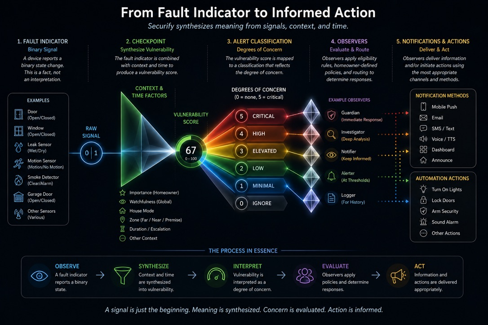

# **Securify Overview**

Securify is an awareness engine.

Rather than simply reacting to devices, Securify continuously interprets the signalling device with respect to the home’s condition, evaluates its significance, and determines whether that condition deserves the homeowner’s attention.

Unlike a traditional alarm system, Securify is not concerned solely with emergencies. Its purpose is to identify meaningful conditions before they become emergencies—or to recognize conditions that may never become emergencies, but still warrant awareness.

At its core, Securify transforms simple binary device states into meaningful information.

---

# **From Signals to Awareness**

Every security-related device reports simple information.

A door is open or closed.

A lock is locked or unlocked.

A motion detector is active or inactive.

An occupancy state is occupied or vacant.

Individually, these signals have little meaning.

Their significance depends on context.

Is someone home?

Is everyone asleep?

Has the condition existed for ten seconds or two hours?

How important is this particular door?

Securify continuously answers those questions.




---

# **Checkpoints**

A **Checkpoint** represents something the homeowner cares about.

Each checkpoint interprets one or more binary signals and calculates their current significance.

In doing so, it considers three factors:

- **Importance** — How significant this condition is to the homeowner.
- **Persistence** — Whether the condition becomes more or less concerning over time.
- **Watchfulness** — How alert the home should currently be.

The result is a continuously changing assessment of concern rather than a simple on/off state.

Each checkpoint produces an **Alert Classification**, representing how significant the current condition has become.

---

# **Watchfulness**

The same condition does not always deserve the same response.

An unlocked front door at noon may be perfectly acceptable.

The same unlocked door while everyone is asleep may deserve immediate attention.

Watchfulness allows Securify to adapt automatically to changing household circumstances.

Typically, watchfulness changes as House Mode changes, although homeowners are always free to customize those relationships.

As watchfulness increases, Securify becomes increasingly sensitive to conditions that might otherwise be ignored.

---

# **Observers**

Observers determine whether a particular condition deserves a response.

Each observer defines:

- the condition it is interested in
- any persistence requirements
- any authorization requirements
- the responses to perform when those requirements have been satisfied

Observers can monitor an individual checkpoint or the home as a whole.

They can react when conditions become more severe, become less severe, or enter a particular range of concern.

---

# **Responses**

When an observer determines that a condition deserves attention, it may perform one or more responses.

Responses currently include:

- Spoken announcements
- Email notifications
- Pushover notifications
- Indigo Action Groups
- Indigo Variables

Responses may also be repeated according to homeowner-defined policies for as long as the condition continues to deserve attention.

---

# **Working Together**

The overall flow is straightforward.

```
Binary Device Signals
          │
          ▼
     Checkpoints
  (interpret meaning)
          │
          ▼
 Alert Classification
          │
          ▼
      Observers
(determine whether a
response is warranted)
          │
          ▼
      Responses
```

Each stage has a distinct responsibility.

- Devices report facts.
- Checkpoints interpret those facts.
- Observers
  - recognize when checkpoints deserve attention
  - determine when and whether they are authorized to respond
  - initiate responses that may inform the homeowner.

This separation of responsibilities keeps the system flexible, predictable, and easy to extend.

---

# **Designed Around the Homeowner**

Securify never attempts to decide what _should_ concern you.

Instead, it provides the tools to express your own priorities.

You decide what matters.

You decide when it matters.

You decide how you wish to be informed.

Securify continuously interprets the home’s condition so those decisions can be applied consistently, automatically, and intelligently.


